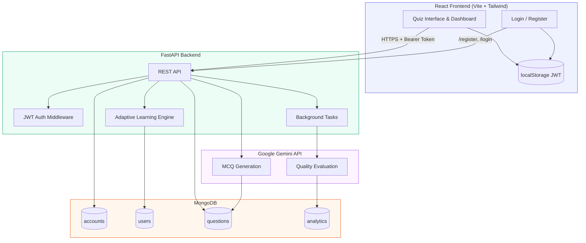

# Personalized MCQ Generator for Diagnostic Tests

An adaptive learning platform that generates personalized multiple-choice questions from educational content, adjusts difficulty based on learner performance, and evaluates question quality with AI-driven analytics.

---

## Table of Contents

- [Project Overview](#project-overview)
- [Architecture](#architecture)
- [Key Features](#key-features)
- [Tech Stack](#tech-stack)
- [Project Structure](#project-structure)
- [Local Setup](#local-setup)
- [Environment Variables](#environment-variables)
- [API Reference](#api-reference)
- [Deployment](#deployment)
- [License](#license)

---

## Project Overview

This application helps educators and learners run **diagnostic quizzes** grounded in custom study material. Users paste educational text (lecture notes, textbook excerpts, etc.), and the system uses **Google Gemini** to produce five multiple-choice questions aligned to that content.

What makes it more than a simple quiz generator:

- **Adaptive difficulty (1–10)** updates after each answer based on answer streaks, so questions get harder or easier over time.
- **JWT authentication** ties progress, difficulty, and analytics to a persistent user profile.
- **Background quality evaluation** sends each answered question to Gemini for Relevance and Clarity scores, stored for insight analytics.
- **MongoDB** persists users, questions, and analytics across sessions.

The **React** frontend provides a focused quiz experience with real-time feedback, explanations, and a dashboard for score, adaptive level, and system performance metrics.

---

## Architecture



### Request flow (quiz session)

1. User authenticates → receives JWT → stored in `localStorage`.
2. User submits educational text → **FastAPI** reads adaptive difficulty from **MongoDB** → **Gemini** generates MCQs → questions saved to **MongoDB**.
3. User answers a question → result submitted → difficulty recalculated → **background task** evaluates question quality via **Gemini** → metrics saved to **analytics** collection.
4. Dashboard polls **insight analytics** for aggregated Relevance/Clarity scores.

---

## Key Features

### Adaptive learning algorithm

The system maintains a per-user **target difficulty** on a scale of **1 (easiest) to 10 (hardest)**, starting at **5** for new learners.

| Event | Behavior |
|--------|----------|
| **3+ consecutive correct answers** | Difficulty increases by 1 (max 10) |
| **2+ consecutive incorrect answers** | Difficulty decreases by 1 (min 1) |

Difficulty is injected into the Gemini prompt when generating questions, so stems, depth, and distractors match the learner’s current level. Answer history and difficulty are stored in the `users` collection.

### AI-powered MCQ generation

- Five questions per generation request, each with four options, a correct answer, and an explanation.
- Structured JSON output with server-side validation.
- Content constrained to the user-provided educational text.

### Question quality evaluation

After each submitted answer, a background job asks Gemini to score the question:

- **Relevance** (1–5) — alignment with source material  
- **Clarity** (1–5) — wording and unambiguity  

Results are stored in MongoDB and surfaced in the **Insight Analytics** dashboard.

### Secure user profiles

- Registration and login with **bcrypt**-hashed passwords (**passlib**).
- **JWT** access tokens for protected routes.
- User-specific data isolation for questions, answers, and analytics.

### Modern quiz UI

- One question at a time with immediate feedback and explanations.
- Live score, adaptive difficulty meter, and analytics sidebar.
- Responsive layout built with **Tailwind CSS**.

---

## Tech Stack

| Layer | Technologies |
|--------|----------------|
| **Frontend** | React 19, Vite, Tailwind CSS v4 |
| **Backend** | Python 3.12, FastAPI, Uvicorn |
| **Database** | MongoDB (Motor async driver) |
| **AI** | Google Gemini (`google-generativeai`) |
| **Auth** | Passlib (bcrypt), python-jose (JWT) |
| **Deployment** | Docker → Render · Vite build → Vercel |

---

## Project Structure

```
.
├── app/                          # FastAPI application
│   ├── auth/                     # JWT & password utilities
│   ├── services/                 # Business logic
│   │   ├── adaptive_learning.py  # Difficulty & streak logic
│   │   ├── auth_service.py       # Register / login
│   │   ├── gemini_mcq.py         # MCQ generation
│   │   ├── quality_evaluation.py # Background LLM scoring
│   │   └── question_store.py     # Questions & analytics DB ops
│   ├── config.py                 # Settings from environment
│   ├── database.py               # Motor connection & indexes
│   └── main.py                   # Routes & middleware
├── client/                       # React frontend
│   ├── src/
│   │   ├── components/           # QuizInterface, Dashboard, AuthPage
│   │   ├── api.js                # API client (Bearer token)
│   │   └── authStorage.js        # JWT in localStorage
│   └── vercel.json               # SPA routing
├── Dockerfile                    # Render production image
├── requirements.txt              # Python dependencies
└── .env.example                  # Environment template
```

---

## Local Setup

### Prerequisites

- **Python 3.12+**
- **Node.js 18+** and npm
- **MongoDB** (local instance or [MongoDB Atlas](https://www.mongodb.com/cloud/atlas) free tier)
- **Google Gemini API key** from [Google AI Studio](https://aistudio.google.com/apikey)

### 1. Clone and configure environment

```bash
git clone <your-repo-url>
cd "Personalized MCQ Generator for Diagnostic Tests"
```

Copy the environment template and fill in your values:

```bash
cp .env.example .env
```

Edit `.env` with at minimum:

- `GEMINI_API_KEY`
- `MONGODB_URI` (e.g. `mongodb://localhost:27017` or Atlas URI)
- `JWT_SECRET_KEY` (long random string)

### 2. Backend

```bash
python -m venv .venv

# Windows
.\.venv\Scripts\Activate.ps1

# macOS / Linux
source .venv/bin/activate

pip install -r requirements.txt
uvicorn app.main:app --reload
```

API runs at **http://localhost:8000**  
Interactive docs: **http://localhost:8000/docs**

### 3. Frontend

```bash
cd client
cp .env.example .env
npm install
npm run dev
```

App runs at **http://localhost:5173**

Ensure `client/.env` contains:

```env
VITE_API_URL=http://localhost:8000
```

### 4. Verify

1. Open the frontend → **Register** a new account.
2. Paste educational content → **Start quiz**.
3. Answer questions and watch difficulty and analytics update.

---

## Environment Variables

### Backend (`.env` at repository root)

| Variable | Required | Description |
|----------|----------|-------------|
| `GEMINI_API_KEY` | Yes | Google Gemini API key |
| `GEMINI_MODEL` | No | Model name (default: `gemini-2.0-flash`) |
| `MONGODB_URI` | Yes | MongoDB connection string |
| `MONGODB_DB_NAME` | No | Database name (default: `mcq_generator`) |
| `JWT_SECRET_KEY` | Yes | Secret for signing JWTs |
| `JWT_ALGORITHM` | No | Default: `HS256` |
| `JWT_EXPIRE_MINUTES` | No | Token lifetime (default: `1440`) |
| `CORS_ORIGINS` | No | Comma-separated frontend URLs |

### Frontend (`client/.env`)

| Variable | Required | Description |
|----------|----------|-------------|
| `VITE_API_URL` | Yes (prod) | Backend URL (e.g. `http://localhost:8000`) |

---

## API Reference

| Method | Endpoint | Auth | Description |
|--------|----------|------|-------------|
| `GET` | `/health` | No | Health check + DB ping |
| `POST` | `/register` | No | Create account, return JWT |
| `POST` | `/login` | No | Authenticate, return JWT |
| `POST` | `/generate-mcq` | Yes | Generate 5 MCQs from text |
| `POST` | `/submit-answer` | Yes | Record answer, update difficulty |
| `GET` | `/insight-analytics` | Yes | Aggregated quality metrics |

Protected routes require header:

```http
Authorization: Bearer <access_token>
```

---

## Deployment

| Component | Platform | Config |
|-----------|----------|--------|
| **Backend** | [Render](https://render.com) (Docker) | Set env vars in Render dashboard; use `Dockerfile` |
| **Frontend** | [Vercel](https://vercel.com) | Root directory: `client`; set `VITE_API_URL` |
| **Database** | MongoDB Atlas | Allow `0.0.0.0/0` for Render; use connection string in `MONGODB_URI` |

**Deploy order:** MongoDB Atlas → Render (API) → Vercel (frontend) → add Vercel URL to `CORS_ORIGINS` on Render.

**Docker (local production test):**

```bash
docker build -t mcq-api .
docker run --env-file .env -p 8000:10000 -e PORT=10000 mcq-api
```

---

## License

This project is provided for educational and portfolio purposes. Add your chosen license file if you open-source the repository.
